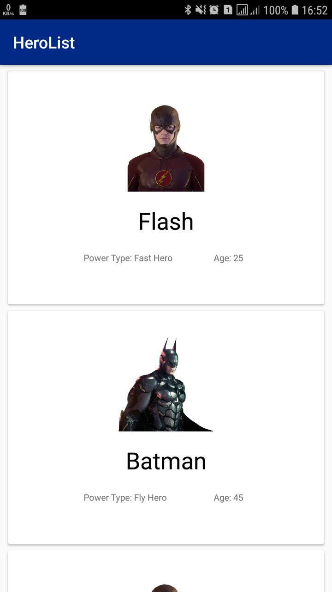
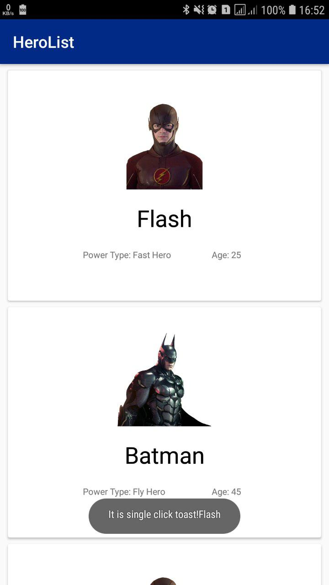

# Short Description
- Link to git repository is provided

- Short description and screenshots provided in a github readme.md file

- Apk file is on releases in the same repository

- RecycleView or Adapter with at least 10 elements, each view should consist of 3 fields (Hero name, age, power type)

- Single click on an element should open a Toast message with Hero name

- Long click should open Another activity with photo of hero on it

- Screenshot: 

# recycle view list

# toast

# activity detail

